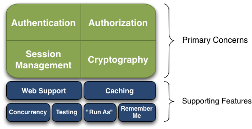
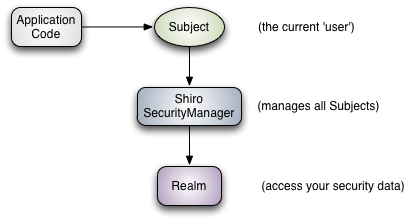
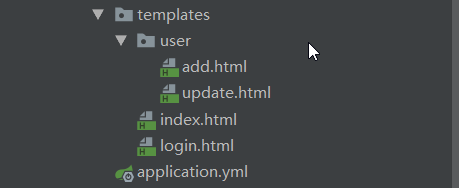
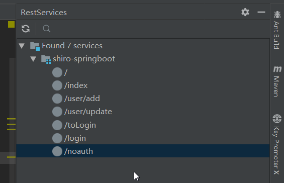
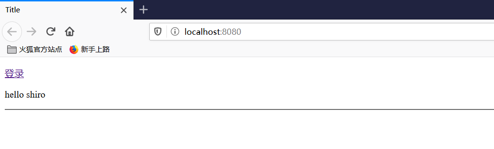

### shiro笔记

#### 1、shiro简介

-   `Apache Shiro` 是一个功能强大、灵活的，开源的安全框架。它可以干净利落地处理身份验证、授权、企业会话管理和加密。
-   `Apache Shiro` 的首要目标是易于使用和理解。安全通常很复杂，甚至让人感到很痛苦，但是 Shiro 却不是这样子的。一个好的安全框架应该屏蔽复杂性，向外暴露简单、直观的 API，来简化开发人员实现应用程序安全所花费的时间和精力。

#### 2、shiro能做什么

-   验证用户身份

-   用户访问权限控制，比如：1、判断用户是否分配了一定的安全角色。2、判断用户是否被授予完成某个操作的权限

-   在非 `Web `或 `EJB `容器的环境下可以任意使用` Session API`

-   可以响应认证、访问控制，或者 Session 生命周期中发生的事件

-   可将一个或以上用户安全数据源数据组合成一个复合的用户 “`view`”(视图)

-   支持单点登录(`SSO`)功能

-   支持提供“`Remember Me`”服务，获取用户关联信息而无需登录

    …等等

>   Shiro 致力在所有应用环境下实现上述功能,而且不需要借助第三方框架、容器、应用服务器等。当然 Shiro 的目的是尽量的融入到这样的应用环境中去，但也可以在它们之外的任何环境下开箱即用。

#### 3、shiro的特点

`Apache Shiro `是一个全面的、蕴含丰富功能的安全框架。



>   Authentication（认证）, Authorization（授权）, Session Management（会话管理）, Cryptography（加密）被 Shiro 框架的开发团队称之为应用安全的四大基石。

-   **Authentication（认证）：**用户身份识别，通常被称为用户“登录”
-   **Authorization（授权）：**访问控制。比如某个用户是否具有某个操作的使用权限。
-   **Session Management（会话管理）：**特定于用户的会话管理,甚至在非web 或 EJB 应用程序。
-   **Cryptography（加密）：**在对数据源使用加密算法加密的同时，保证易于使用。


还有其他的功能来支持和加强这些不同应用环境下安全领域的关注点。

-   Web`支持`：`Shiro `提供的 `Web` 支持 `api `，可以很轻松的保护 `Web `应用程序的安全。
-   缓存：缓存是 `Apache Shiro` 保证安全操作快速、高效的重要手段。
-   并发：`Apache Shiro` 支持多线程应用程序的并发特性。
-   测试：支持单元测试和集成测试，确保代码和预想的一样安全。
-   “`Run As`”：这个功能允许用户假设另一个用户的身份(在许可的前提下)。
-   “`Remember Me`”：跨 `session `记录用户的身份，只有在强制需要时才需要登录。

>   Shiro 不会去维护用户、维护权限，这些需要我们自己去设计/提供，然后通过相应的接口注入给 Shiro即可

#### 4、shiro的架构

在概念层，`Shiro `架构包含三个主要的理念：`Subject`，`SecurityManager`和 `Realm`。



-   `Subject`：当前用户，`Subject` 可以是一个人，但也可以是第三方服务、守护进程帐户、时钟守护任务或者其它–当前和软件交互的任何事件。
-   `SecurityManager`：管理所有Subject，`SecurityManager `是 `Shiro` 架构的核心，配合内部安全组件共同组成安全伞。
-   `Realms`：用于进行权限信息的验证，我们自己实现。`Realm `本质上是一个特定的安全 `DAO`：它封装与数据源连接的细节，得到`Shiro `所需的相关的数据。在配置 `Shiro `的时候，你必须指定至少一个`Realm `来实现认证（`authentication`）和/或授权（`authorization`）。

>   我们需要实现`Realms`的`Authentication `和 `Authorization`。其中 `Authentication `是用来验证用户身份，`Authorization `是授权访问控制，用于对用户进行的操作授权，证明该用户是否允许进行当前操作，如访问某个链接，某个资源文件等。

#### 5、快速上手

码云地址：（传送门）

##### 5.1、pom包依赖

```xml
  <!--引入shiro核心-->
        <dependency>
            <groupId>org.apache.shiro</groupId>
            <artifactId>shiro-core</artifactId>
            <version>1.4.1</version>
        </dependency>
        <dependency>
            <groupId>org.apache.shiro</groupId>
            <artifactId>shiro-spring</artifactId>
            <version>1.4.1</version>
        </dependency>
```

##### 5.2、页面

-   index.html ：首页
-   login.html ：登录页
-   add.html ：添加页面
-   update.html ：更新页面
-   /noauth： 没有权限的页面





##### 5.3、Shiro 配置

首先要配置的是 `ShiroConfig `类，`Apache Shiro` 核心通过 `Filter `来实现，就好像 `SpringMvc `通过 `DispachServlet `来主控制一样。 既然是使用 `Filter` 一般也就能猜到，是通过 `URL `规则来进行过滤和权限校验，所以我们需要定义一系列关于 `URL `的规则和访问权限。

**`ShiroConfig`**

```java
    @Bean
    public ShiroFilterFactoryBean getShiroFilterFactoryBean(@Qualifier("securityManager")DefaultWebSecurityManager defaultWebSecurityManager){
        ShiroFilterFactoryBean bean = new ShiroFilterFactoryBean();
        //设置安全管理器
        bean.setSecurityManager(defaultWebSecurityManager);

        //用于拦截的过滤器链的容器
        Map<String, String> filterMap = new LinkedHashMap<>();

        filterMap.put("/user/*","authc");

        //放入Shiro过滤器
        bean.setFilterChainDefinitionMap(filterMap);

        //设置登入界面
        bean.setLoginUrl("/toLogin");
        //设置未授权页面
        bean.setUnauthorizedUrl("/noauth");

        return bean;
    }

    //DefaultWebSecurituManager :2
    @Bean(name="securityManager")
    public DefaultWebSecurityManager getDefaultWebSecurityManager(@Qualifier("userRealm") UserRealm userRealm){
        DefaultWebSecurityManager securityManager = new DefaultWebSecurityManager();
        //关联UserRealm
        securityManager.setRealm(userRealm);

        return securityManager;
    }
    //创建realm对象 ，需要自定义 :1
    @Bean(name = "userRealm")
    public UserRealm userRealm(){
        return new UserRealm();
    }
```

>   创建`realm`对象————创建`SecurityManager `————创建`ShiroFilterFactoryBean`

`Filter Chain` 定义说明：

-   1、一个`URL`可以配置多个 `Filter`，使用逗号分隔
-   2、当设置多个过滤器时，全部验证通过，才视为通过
-   3、部分过滤器可指定参数，如 `perms`，`roles`

| Filter Name | explain                                                      |
| :---------- | :----------------------------------------------------------- |
| anon        | org.apache.shiro.web.filter.authc.AnonymousFilter            |
| authc       | org.apache.shiro.web.filter.authc.FormAuthenticationFilter   |
| authcBasic  | org.apache.shiro.web.filter.authc.BasicHttpAuthenticationFilter |
| perms       | org.apache.shiro.web.filter.authz.PermissionsAuthorizationFilter |
| port        | org.apache.shiro.web.filter.authz.PortFilter                 |
| rest        | org.apache.shiro.web.filter.authz.HttpMethodPermissionFilter |
| roles       | org.apache.shiro.web.filter.authz.RolesAuthorizationFilter   |
| ssl         | org.apache.shiro.web.filter.authz.SslFilter                  |
| user        | org.apache.shiro.web.filter.authc.UserFilter                 |

-   anon: 无需认证就可访问
-   authc：必须认证才能访问
-   user：必须拥有记住我功能才能访问
-   perms: 拥有对某个资源的权限才能访问
-   role:拥有某个角色权限才能访问

##### 5.4、Real配置

>   最终处理都将交给Real进行处理。因为在 Shiro 中，最终是通过 Realm 来获取应用程序中的用户、角色及权限信息的。通常情况下，在 Realm 中会直接从我们的数据源中获取 Shiro 需要的验证信息。

-   1、检查提交的进行认证的令牌信息
-   2、根据令牌信息从数据源(通常为数据库)中获取用户信息
-   3、对用户信息进行匹配验证。
-   4、验证通过将返回一个封装了用户信息的`AuthenticationInfo`实例。
-   5、验证失败则抛出`AuthenticationException`异常信息。


自定义一个 `Realm `类，继承`AuthorizingRealm `抽象类，重载 `doGetAuthenticationInfo()`，重写获取用户信息的方法。

```java
  @Override
    protected AuthenticationInfo doGetAuthenticationInfo(AuthenticationToken token) throws AuthenticationException {
        System.out.println("执行了=>认证doGetAuthenticationInfo");

        UsernamePasswordToken userToken = (UsernamePasswordToken) token;

        //从真实数据库去查数据
        User user = userService.queryUserByName(userToken.getUsername());

        if (DefaultFilter.user ==null){
            return null;
        }

        //可以加密
        //Object principal, Object credentials, String realmName
        //Object principal      用个传入一个对象
        return new SimpleAuthenticationInfo("",user.getPwd(),"");
    }
```


##### 测试登录

http://localhost:8080/



